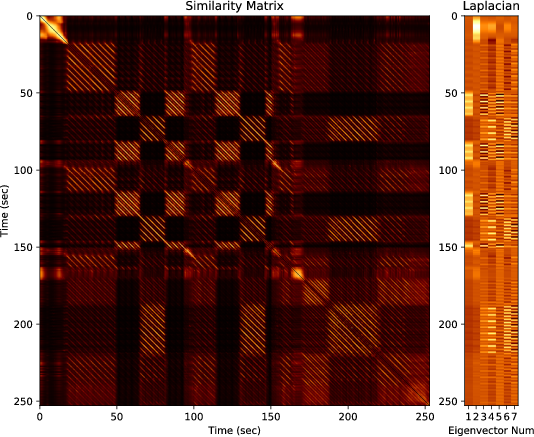

# GraphDitty

The purpose of this code is to compute clean weighted adjacency matrices for audio files using similarity network fusion, which can be used to do clean structure analysis.  This is based on ideas from the following [paper]:

Christopher J Tralie. ``MFCC and HPCP fusion for robust cover song identification.'' In 18th International Society for Music Information Retrieval (ISMIR), 2017.

### Example Adjacency Matrix on Michael Jacksons's Bad

## Dependencies
* numpy/scipy/matplotlib
* [librosa]

## Running
To see all options, run the script as follows
~~~~~ bash
python SongStructure.py --help
~~~~~
There are options to view each iteration of the fusion.  By default, the results are saved to a .mat file called ``out.mat'' and to a file "out.json" (you can changes this via command line options).  You can open the .json file in the web page "Viewer/index.html" to interactively view the similarity matrix and Laplacian eigenvectors.

[Chris Tralie]: <http://www.ctralie.com>
[librosa]: <http://librosa.github.io/>
[paper]: <http://www.covers1000.net/ctralie2017_EarlyMFCC_HPCPFusion.pdf>
