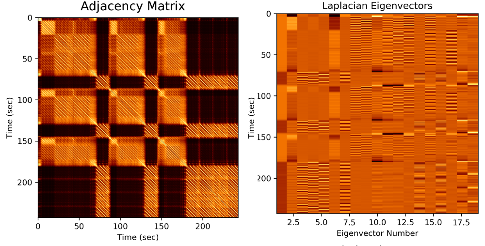

# GraphDitty

The purpose of this code is to compute clean weighted adjacency matrices for audio files using similarity network fusion, which can be used to do clean structure

## Dependencies
* Numpy/Matplotlib
* [librosa]

## Running
To see all options, run the script as follows
~~~~~ bash
python SongStructure.py --help
~~~~~
By default, the results are saved to a .mat file called ``out.mat'' (you can changes this via command line options).  You can also see each iteration of feature fusion, along with a graph Laplacian to show structure.

[Chris Tralie]: <http://www.ctralie.com>
[librosa]: <http://librosa.github.io/>